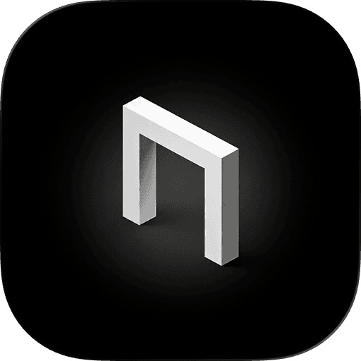
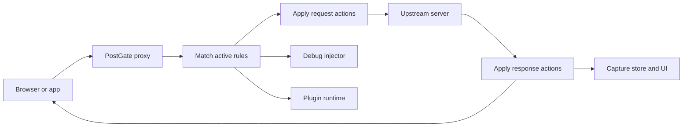

<p align="center">
  
</p>

<h1 align="center">PostGate</h1>

<p align="center">
  <strong>A local-first desktop proxy for frontend development.</strong><br />
  Inspect, rewrite, replay, and debug HTTP, HTTPS, and WebSocket traffic from one workspace.
</p>

<p align="center">
  <a href="https://github.com/backrunner/postgate/releases/latest"><strong>Download</strong></a>
  &nbsp;&middot;&nbsp;
  <a href="https://postgate.alkinum.io/docs"><strong>Documentation</strong></a>
  &nbsp;&middot;&nbsp;
  <a href="docs/whistle-compatibility.md"><strong>Rule compatibility</strong></a>
  &nbsp;&middot;&nbsp;
  <a href="docs/plugins.md"><strong>Plugin guide</strong></a>
</p>

<p align="center">
  <a href="https://github.com/backrunner/postgate/actions/workflows/ci.yml"></a>
  <a href="https://github.com/backrunner/postgate/releases/latest"></a>
  
  <a href="LICENSE"></a>
</p>

---

PostGate places a programmable checkpoint between your browser and the network. It captures local development traffic, applies rules before and after upstream requests, and keeps the complete exchange available for inspection and replay.

The proxy binds to localhost by default. Captures, rules, replay collections, certificates, and plugin state stay on your machine in SQLite; cloud sync is optional.

## One Workspace For The Whole Request

| Workspace | What it handles |
| --- | --- |
| **Capture** | Inspect methods, status codes, timing, headers, bodies, TLS details, and matched rules. |
| **Rules** | Map hosts, redirect URLs, replace files or bodies, inject code, edit headers, delay, throttle, mock, and debug. |
| **Replay** | Save requests into collections, edit every part of a request, and run it again without leaving the app. |
| **Debug** | Discover pages as CDP-style targets and capture console output, runtime errors, Fetch, and XHR activity. |
| **Plugins** | Extend request and response handling with an embedded JavaScript runtime, persistent state, panels, and notifications. |
| **Profiles** | Move rules, values, replay data, certificates, UI preferences, and sync settings between machines. |

## Install And Run

Download a signed build from [GitHub Releases](https://github.com/backrunner/postgate/releases/latest), or run PostGate from source with Node.js 22.13+, pnpm 11.10+, Rust 1.77+, and the [Tauri 2 platform prerequisites](https://v2.tauri.app/start/prerequisites/):

```bash
pnpm install
pnpm dev:desktop
```

PostGate listens on `127.0.0.1:8899` by default. Point your browser or device at that address for both HTTP and HTTPS proxying. HTTPS inspection requires explicitly trusting the PostGate root CA generated by the app.

## Rules That Read Like Intent

PostGate follows Whistle's rule model, so common development overrides stay short and reviewable:

```text
# Send an API host to a local service
api.example.com host://127.0.0.1:3000

# Replace a production bundle with a local file
https://cdn.example.com/app.js file:///Users/me/project/dist/app.js

# Add CORS headers and slow one endpoint down
api.example.com/path resCors://* delay://500

# Inject the browser debug bridge into matching HTML pages
example.com debug://

# Run a PostGate plugin with JSON configuration
api.example.com plugin://mock-api?fixture=checkout
```

Patterns may be exact URLs, domains, path prefixes, wildcards, or regular expressions. Filters can narrow a match by method, protocol, port, content type, client IP, or status. The [compatibility reference](docs/whistle-compatibility.md) lists the supported protocol matrix.

## How Traffic Moves



The React and Tauri shell owns the desktop experience. The Rust backend owns networking, TLS, rule parsing and application, persistence, replay execution, plugin execution, and profile transfer. Tokio, Hyper, rustls, DashMap, and SQLite keep the hot path asynchronous and local.

## Protocol And Runtime Notes

- HTTP/1.1 and HTTP/2 are available in the default local build.
- GitHub release builds include optional QUIC/HTTP/3 ingress.
- External rules can be included with `@/path/to/rules.txt` or `includeFile:///path/to/rules.txt`; PostGate watches included files for changes.
- Plugins run inside an embedded V8 runtime with scoped PostGate APIs rather than Node.js, filesystem, or process globals.
- Automatic updates are signed and delivered through [GitHub Releases](https://github.com/backrunner/postgate/releases).

## Develop PostGate

```text
postgate/
|-- apps/desktop/              Tauri desktop app and React UI
|   |-- src/                   Pages, stores, components, and editors
|   `-- src-tauri/src/         Proxy, rules, storage, certs, and commands
|-- apps/docs/                 Product site and documentation
|-- packages/inject-client/    Browser debug injection client
|-- packages/plugin-sdk/       Public plugin development SDK
|-- packages/shared/           Shared TypeScript types
|-- examples/                  Installable example plugins
`-- docs/                      Repository guides and compatibility notes
```

| Command | Purpose |
| --- | --- |
| `pnpm dev:desktop` | Start package watchers and the Tauri desktop app. |
| `pnpm build` | Build every workspace package and the frontend. |
| `pnpm tauri:build` | Produce local desktop bundles. |
| `pnpm typecheck` | Run workspace TypeScript checks. |
| `pnpm lint` | Run workspace lint tasks. |
| `pnpm test` | Run workspace tests. |
| `cargo test --manifest-path apps/desktop/src-tauri/Cargo.toml --features quic` | Run the Rust suite with HTTP/3 enabled. |

Plugins are npm packages named `postgate-plugin-*` or `@postgate/plugin-*`. Start with the [plugin guide](docs/plugins.md) and the [mock API example](examples/postgate-plugin-mock-api).

## Security

PostGate is intended for local development. Keep proxy and debug services bound to localhost unless remote access is deliberate. Installing its root CA allows PostGate to decrypt traffic routed through it; rotate the CA if its private key is exposed, and review captures before sharing them because headers and bodies may contain credentials.

Profile exports may contain the CA private key and WebDAV credentials. Treat exported profiles as secrets.

## License

[MIT](LICENSE)
