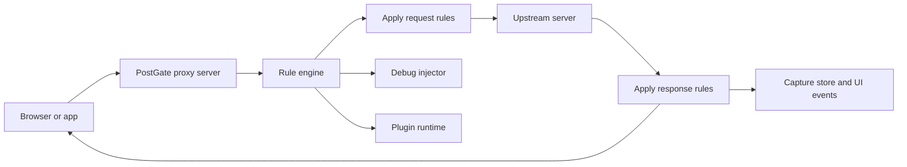

<p align="center">
  
</p>

<h1 align="center">PostGate</h1>

<p align="center">
  A desktop MITM proxy for local frontend development, request rewriting, replay, and browser debugging.
</p>

<p align="center">
  
  
  
  
</p>

## Overview

PostGate is a Tauri-based desktop proxy for frontend engineers who need to inspect, reshape, replay, and debug traffic without leaving their local workflow. It captures HTTP and HTTPS requests, applies Whistle-compatible rules, injects browser debugging hooks, and keeps rules, certificates, replay collections, and app preferences portable across machines.

It is built for daily development work: compact UI, fast capture views, local-first storage, and a Rust async proxy pipeline that stays responsive under real traffic.

## Highlights

- HTTP and HTTPS traffic capture with method, status, timing, headers, body metadata, TLS details, and matched rules.
- Whistle-compatible rule groups for host mapping, redirects, status overrides, headers, body replacement, injection, delay, throttle, CORS, auth, cookies, debug, and plugin actions.
- Optional HTTP/3 ingress on localhost behind the Rust `quic` feature, bridged into the same rule and capture pipeline as HTTP/1.1 and HTTP/2.
- External local rule files via Whistle-style `@/path/to/rules.txt` or PostGate's `includeFile:///path/to/rules.txt`; files are watched and merged into the active rule set.
- Local CA generation, certificate export, and system trust installation for HTTPS inspection.
- Replay collections for saving, organizing, editing, and re-running requests.
- Browser debug mode with CDP-style target discovery, console capture, errors, fetch, and XHR instrumentation.
- Plugin SDK and runtime hooks for extending proxy behavior.
- Profile export/import for rules, values, replay data, certificates, UI settings, proxy settings, update settings, and sync settings.
- Settings sync using the same profile snapshot format over iCloud Drive or WebDAV.

## Architecture



PostGate is split into a React/Tauri desktop shell and a Rust backend. The frontend manages capture views, rule editing, replay, plugins, debugging, updates, and settings. The backend owns proxy networking, TLS certificate generation, rule parsing and application, persistence, replay execution, plugin execution, and profile backup/sync.

## Quick Start

Requirements:

- Node.js 22.13 or newer
- pnpm 11.10 or newer
- Rust 1.77 or newer
- Platform prerequisites for Tauri 2

```bash
pnpm install
pnpm dev:desktop
```

The desktop app starts a Vite dev server on port `1420` and launches Tauri in development mode.

## Scripts

```bash
pnpm dev              # Run package watch tasks
pnpm dev:desktop      # Start the desktop app in Tauri dev mode
pnpm build            # Build all workspace packages
pnpm tauri:build      # Build packages and produce desktop bundles
pnpm typecheck        # Run workspace type checks
pnpm test             # Run workspace tests
pnpm lint             # Run workspace lint tasks
```

## Workspace

```text
postgate/
├── apps/desktop/              # Tauri desktop app and React UI
│   ├── src/                   # Pages, stores, components, editor integrations
│   └── src-tauri/src/         # Rust proxy, rules, storage, certs, commands
├── packages/inject-client/    # Browser-side debug injection client
├── packages/plugin-sdk/       # SDK for PostGate plugins
├── packages/shared/           # Shared TypeScript types and utilities
└── examples/                  # Example plugins
```

## Plugins

Plugins run in an embedded V8 runtime and can short-circuit requests, modify upstream responses, persist local state, register sandboxed UI panels, and show notifications. See [docs/plugins.md](docs/plugins.md) for the package contract and [examples/postgate-plugin-mock-api](examples/postgate-plugin-mock-api) for an installable example.

## Releases And Updates

Desktop releases are built for macOS, Linux, and Windows through GitHub Actions. The workflow signs Tauri updater artifacts, validates the cross-platform `latest.json` manifest, and publishes the draft only after every platform is present. See [docs/releases.md](docs/releases.md) for required secrets and the release procedure.

## Profile Backup And Sync

PostGate profiles are portable JSON snapshots. A profile can include:

- Rule groups and reusable values
- Replay collections and saved requests
- Root CA certificate and private key
- Proxy, theme, columns, update, and sync settings

Manual transfer is available from `Settings -> Profile Transfer`. Sync uses the same snapshot format from `Settings -> Settings Sync` and currently supports:

- iCloud Drive: writes `postgate-profile.json` under `Cloud Drive/Documents/PostGate` by default on macOS.
- WebDAV: uploads and downloads the same JSON profile using `HEAD`, `GET`, `PUT`, and `MKCOL`.

Profile files are sensitive because they can contain the PostGate root CA private key and WebDAV credentials. Store them only in locations you trust.

## Security Notes

PostGate is intended for local development. By default, proxy services should stay bound to localhost unless you deliberately expose them. Installing the root CA allows HTTPS inspection for traffic routed through PostGate, so remove or rotate the CA if the profile or key is shared accidentally.

Sensitive headers such as `Authorization` and `Cookie` should be treated carefully when exporting captures, replay collections, or profile data.

## Protocol Compatibility

Rule compatibility is tracked against Whistle v2.10.6 in [docs/whistle-compatibility.md](docs/whistle-compatibility.md). PostGate rejects or reports protocols it cannot faithfully apply instead of silently treating them as successful rules.

The default local desktop build does not include QUIC dependencies. Automated GitHub releases include the feature; build or test it locally with:

```bash
cd apps/desktop/src-tauri
cargo test --features quic
```

## Roadmap

- MASQUE `CONNECT-UDP` support for standards-based UDP tunneling through the HTTP/3 ingress.
- Team-oriented sharing for rules and replay collections.
- Deeper plugin sandboxing and permission controls.
- Mobile companion workflows for remote debugging.

## License

MIT
