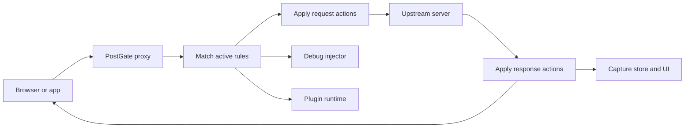

<p align="center">
  
</p>

<h1 align="center">PostGate</h1>

<p align="center">
  <strong>Inspect, reshape, replay, and debug local web traffic.</strong>
</p>

<p align="center">
  A local-first desktop proxy built for frontend development, with Whistle-compatible rules,
  HTTPS interception, request replay, browser debugging, and an extensible plugin runtime.
</p>

<p align="center">
  <a href="https://github.com/backrunner/postgate/actions/workflows/ci.yml"></a>
  <a href="https://github.com/backrunner/postgate/releases/latest"></a>
  
  
  
  <a href="LICENSE"></a>
</p>

<p align="center">
  <a href="https://github.com/backrunner/postgate/releases/latest"><strong>Download latest</strong></a>
  &nbsp;&middot;&nbsp;
  <a href="docs/whistle-compatibility.md">Rule reference</a>
  &nbsp;&middot;&nbsp;
  <a href="docs/plugins.md">Plugin guide</a>
  &nbsp;&middot;&nbsp;
  <a href="docs/releases.md">Release guide</a>
</p>

---

## What PostGate Does

PostGate puts a programmable checkpoint between your browser and the network. It captures HTTP and HTTPS traffic, applies rules before and after upstream requests, and exposes the result in a compact desktop workspace.

| Workflow | What you can do |
| --- | --- |
| **Capture** | Inspect methods, status codes, timing, headers, bodies, TLS details, and matched rules. |
| **Rules** | Map hosts, redirect URLs, replace files or bodies, inject code, edit headers, delay, throttle, mock, and debug. |
| **Replay** | Save requests into collections, edit every part of a request, and execute it again without leaving the app. |
| **Debug** | Discover pages as CDP-style targets and capture console output, runtime errors, Fetch, and XHR activity. |
| **Plugins** | Extend request and response handling with an embedded JavaScript runtime, persistent state, panels, and notifications. |
| **Profiles** | Move rules, values, replay data, certificates, UI preferences, and sync settings between machines. |

Everything stays local by default: the proxy binds to localhost, data is stored in SQLite, and cloud sync is opt-in through iCloud Drive or WebDAV.

## Start In Two Commands

Requirements: Node.js 22.13+, pnpm 11.10+, Rust 1.77+, and the [Tauri 2 platform prerequisites](https://v2.tauri.app/start/prerequisites/).

```bash
pnpm install
pnpm dev:desktop
```

PostGate starts the desktop app, creates a local certificate authority when needed, and listens on port `8899` by default. Configure your browser or device to use `127.0.0.1:8899` as its HTTP and HTTPS proxy.

## Rules That Read Like Intent

PostGate follows Whistle's rule model, so common local-development changes stay short and reviewable:

```text
# Send an API host to a local service
api.example.com host://127.0.0.1:3000

# Replace a production bundle with a local file
https://cdn.example.com/app.js file:///Users/me/project/dist/app.js

# Add CORS headers and slow one endpoint down
api.example.com/path resCors://* delay://500

# Inject the browser debug bridge into matching HTML pages
example.com debug://

# Run a PostGate plugin with JSON configuration
api.example.com plugin://mock-api?fixture=checkout
```

Patterns can be exact URLs, domains, path prefixes, wildcards, or regular expressions. Filters narrow a rule by method, protocol, port, content type, client IP, or status. See the [compatibility reference](docs/whistle-compatibility.md) for the supported protocol matrix.

## Architecture



The React and Tauri shell owns the desktop experience. The Rust backend owns networking, TLS, rule parsing and application, persistence, replay execution, plugin execution, and profile transfer. Tokio, Hyper, rustls, DashMap, and SQLite keep the hot path asynchronous and local.

## Feature Notes

- HTTP/1.1 and HTTP/2 are available in the default local build.
- GitHub release builds include the optional QUIC/HTTP/3 ingress.
- HTTPS inspection uses a PostGate root CA that must be explicitly trusted by the operating system.
- External rules can be included with `@/path/to/rules.txt` or `includeFile:///path/to/rules.txt`; PostGate watches included files for changes.
- Profile exports can contain the CA private key and WebDAV credentials. Treat them as secrets.
- Automatic updates are signed and delivered from [GitHub Releases](https://github.com/backrunner/postgate/releases).

## Workspace

```text
postgate/
|-- apps/desktop/              Tauri desktop app and React UI
|   |-- src/                   Pages, stores, components, and editors
|   `-- src-tauri/src/         Proxy, rules, storage, certs, and commands
|-- packages/inject-client/    Browser debug injection client
|-- packages/plugin-sdk/       Public plugin development SDK
|-- packages/shared/           Shared TypeScript types
|-- examples/                  Installable example plugins
`-- docs/                      Rules, plugins, and release documentation
```

## Development

| Command | Purpose |
| --- | --- |
| `pnpm dev:desktop` | Start package watchers and the Tauri desktop app. |
| `pnpm build` | Build every workspace package and the frontend. |
| `pnpm tauri:build` | Produce local desktop bundles. |
| `pnpm typecheck` | Run workspace TypeScript checks. |
| `pnpm lint` | Run workspace lint tasks. |
| `pnpm test` | Run workspace tests. |
| `cargo test --manifest-path apps/desktop/src-tauri/Cargo.toml --features quic` | Run the Rust suite with HTTP/3 enabled. |

## Plugins

Plugins are npm packages named `postgate-plugin-*`. They can intercept requests and responses, persist local state, register sandboxed panels, and show notifications from an embedded V8 runtime. Start with the [plugin guide](docs/plugins.md) and the [mock API example](examples/postgate-plugin-mock-api).

## Security

PostGate is intended for local development. Keep proxy and debug services bound to localhost unless remote access is deliberate. Installing the root CA allows PostGate to decrypt traffic routed through it; rotate the CA if its private key is exposed, and review captures before sharing them because headers and bodies may contain credentials.

## License

[MIT](LICENSE)
